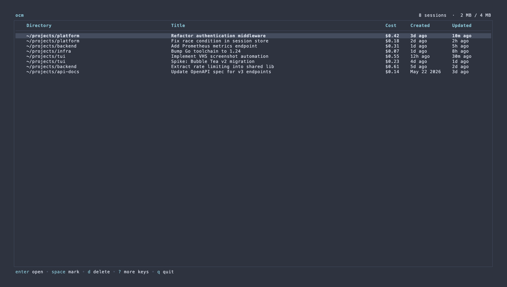
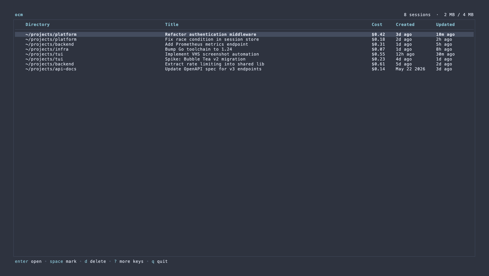

# ocm

Interactive TUI for browsing and managing your OpenCode sessions. Lists all sessions from the local OpenCode database with cost, directory, and timestamps — and lets you open, delete, and clean up directly from the table.



## Requirements

OpenCode installed and at least one session created. The database is read from:

```
~/.local/share/opencode/opencode.db
```

## Install

```bash
brew install kimoofey/tap/ocm
```

Or build from source:

```bash
go install github.com/kimoofey/tui/cmd/ocm@latest
```

## Usage



```
ocm [OPTIONS]

  --sessions    Show only top-level sessions, hide subagent workflows
  --cost-period Show period cost in title bar: week|month|year
  --version     Print version and exit
```

## What the table shows

| Column    | Description                                                  |
| --------- | ------------------------------------------------------------ |
| (mark)    | `●` when selected for bulk action                            |
| Directory | Working directory of the session (home dir shortened to `~`) |
| Title     | Session title as set by OpenCode                             |
| Cost      | Accumulated LLM cost                                         |
| Created   | Session creation time                                        |
| Updated   | Last activity time                                           |

## Keybindings

| Key               | Action                                                                  |
| ----------------- | ----------------------------------------------------------------------- |
| `↑/k` `↓/j`       | Navigate                                                                |
| `PgUp/b` `PgDn/f` | Page up / down                                                          |
| `Space`           | Mark / unmark row for bulk action                                       |
| `Enter`           | Open session in OpenCode                                                |
| `r`               | Reload sessions and stats from the database                             |
| `d`               | Delete session (or all marked) — press `d` again to confirm             |
| `v`               | Vacuum database — reclaims free pages (skipped if < 1 MB reclaimable)   |
| `p`               | Prune orphaned diff files — removes leftover files for deleted sessions |
| `esc`             | Clear marks / close help / cancel pending action                        |
| `?`               | Toggle full help                                                        |
| `q`               | Quit                                                                    |

## Database maintenance

**Vacuum** runs SQLite's `VACUUM` command to compact the database file and reclaim space freed by deleted sessions. Only offered when there is at least 1 MB to reclaim.

**Prune orphans** deletes `session_diff` JSON files in OpenCode's storage directory whose parent session no longer exists in the database — safe to run any time.
