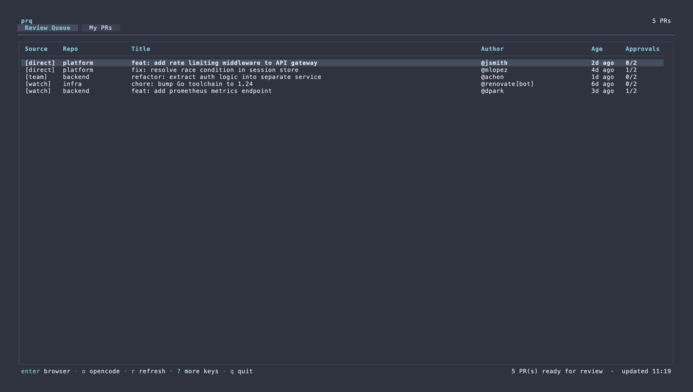
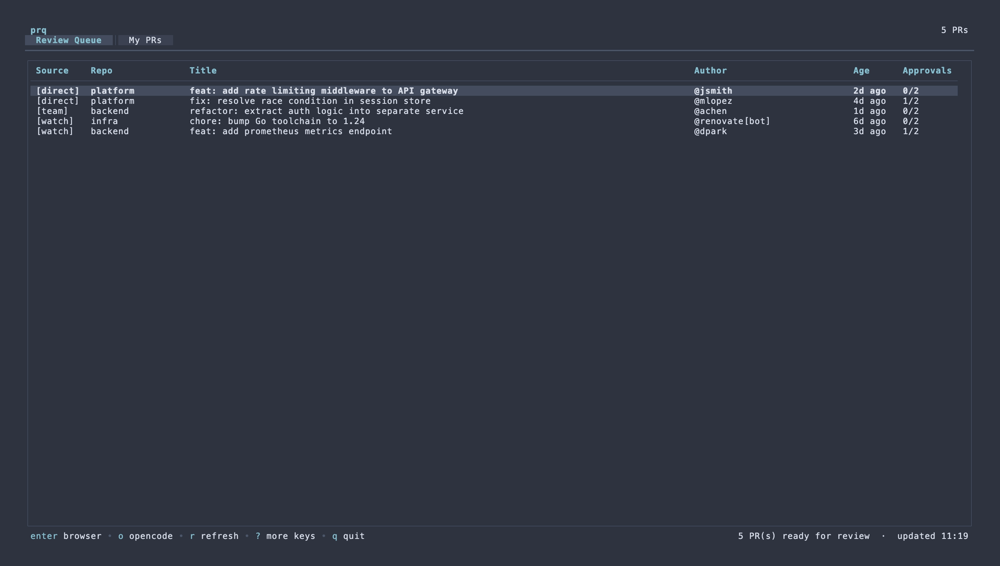

# prq

Interactive TUI for your GitHub PR review queue. Surfaces PRs waiting for your attention across three sources and presents them in a keyboard-driven table.



| Badge      | Source                                                 |
| ---------- | ------------------------------------------------------ |
| `[direct]` | PRs where you were directly requested to review        |
| `[team]`   | PRs where your team or code-owners group was requested |
| `[watch]`  | PRs from repos you voluntarily watch (`watch_repos`)   |

A second tab — **My PRs** — shows open PRs you authored, with their review status.

## Requirements

- [`gh`](https://cli.github.com/) — GitHub CLI, authenticated (`gh auth login`)

## Install

```bash
brew install kimoofey/tap/prq
```

Or build from source:

```bash
go install github.com/kimoofey/tui/cmd/prq@latest
```

## Setup

```bash
prq --init   # scaffolds ~/.config/prq/config.yaml from the built-in template
```

Edit `~/.config/prq/config.yaml` to add repos you want to watch:

```yaml
watch_repos:
  - your-org/your-repo
```

`watch_repos` is optional — prq always fetches your full GitHub review queue regardless.

## Usage



```
prq [OPTIONS]

  --repo ORG/REPO        Add a watch repo for this run (repeatable)
  --days N               Look back N days (default: 30)
  --include-reviewed     Include PRs you've already reviewed
  --include-bots         Include bot-authored PRs (Dependabot, github-actions, etc.)
  --debug                Write diagnostic logs to /tmp/prq-debug.log
  --init                 Scaffold config at ~/.config/prq/config.yaml
  --version              Print version and exit
  -h, --help             Show this help
```

## Keybindings

| Key               | Action                |
| ----------------- | --------------------- |
| `↑/k` `↓/j`       | Navigate              |
| `PgUp/b` `PgDn/f` | Page up / down        |
| `Tab`             | Switch tabs           |
| `Enter`           | Open PR in browser    |
| `o`               | Open PR with opencode |
| `r`               | Refresh from GitHub   |
| `esc`             | Close help / cancel   |
| `?`               | Toggle full help      |
| `q`               | Quit                  |

## opencode integration

If [`opencode`](https://opencode.ai) is installed and in your `$PATH`, pressing `o` opens the selected PR in a new terminal window with opencode pre-loaded for review.

The terminal is auto-detected from `$TERM_PROGRAM`:

| Terminal     | `$TERM_PROGRAM`  |
| ------------ | ---------------- |
| Ghostty      | `ghostty`        |
| iTerm2       | `iTerm.app`      |
| Terminal.app | `Apple_Terminal` |

Override with `opencode_terminal` in your config if auto-detection is wrong.

## Config

Full reference with defaults — scaffold with `prq --init`:

```yaml
watch_repos: [] # repos to watch for volunteer reviews
days_ago: 30 # how far back to look across all sources
min_approvals: 2 # skip PRs that already have this many approvals
skip_already_reviewed: true # skip PRs you've already left a review on
skip_bots: true # skip PRs authored by bots (Dependabot, github-actions, etc.)
opencode_terminal: "" # terminal for `o` key — auto-detected from $TERM_PROGRAM
page_size: 100 # GraphQL results per page (max 100)
max_reviewers: 20 # max reviewer nodes fetched per PR
max_pages: 3 # max pagination pages per source fetch
```

Config is read from `~/.config/prq/config.yaml`.
